# BattleCards

## Application Structure
<!-- 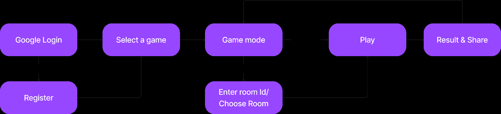 -->
<figure class="image">
  
  <figcaption></figcaption>
</figure>
The proposed game flow of our system involves a series of steps to enable users to access and participate in various card games. To begin with, users are required to log in using their Google account. In the event that they are not registered, they will be directed to a registration page on Firebase Authentication. Once logged in, players can select their preferred card game and game mode. Depending on the selected game mode, users may be prompted to either create or join a room if they wish to play with other users. In the case of private rooms, a password will be required for entry. Alternatively, for games involving AI or random gameplay, users will be able to enter the game immediately. Following the game, a result page will be displayed, showing the user's records and providing an option to share their achievements with friends via Gmail or WhatsApp.

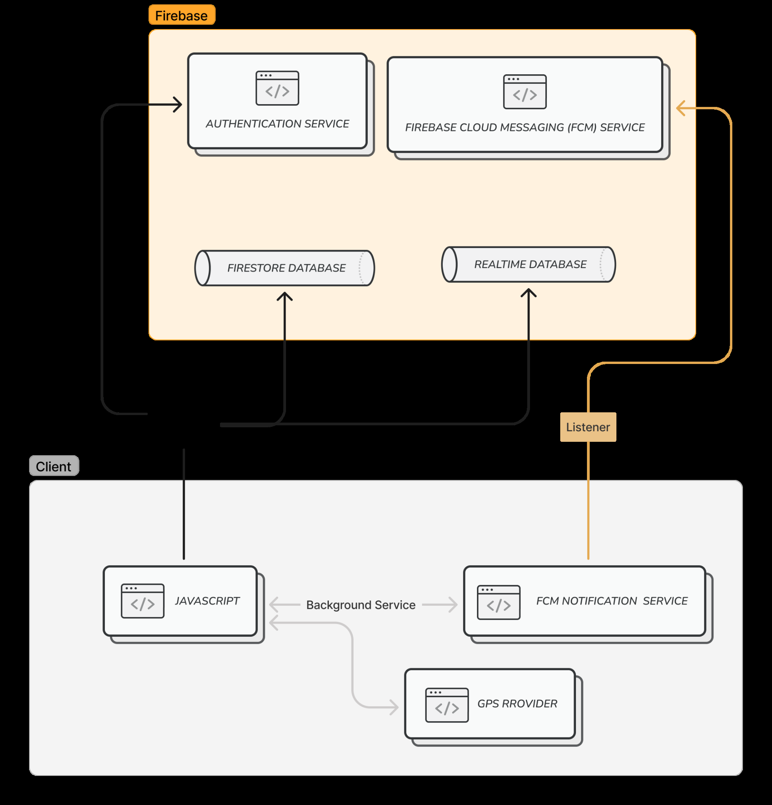
The system structure for our game app is illustrated in the figure above. It comprises an Android app (client) and Firebase (server and database). Firebase offers a range of services such as authentication, Firestore, Realtime Database, and messaging service for notification, all of which will be utilized in our app. To ensure user accountability, we require users to sign in with their Google account, given its widespread usage and convenience. User profile and records are stored in Firestore database, while a separate Realtime Database is used for gameplay. This database will synchronize all changes made by clients, for example, when a user receives or uses a card, other players listening will receive the updates. Finally, the client utilize the GPS provider to obtain its current position and upload the coordinates to the Realtime Database. If players are searching for nearby players, the app will read from the database and display only those within a 20 km radius.
The below figures are the expected user interface of our application.
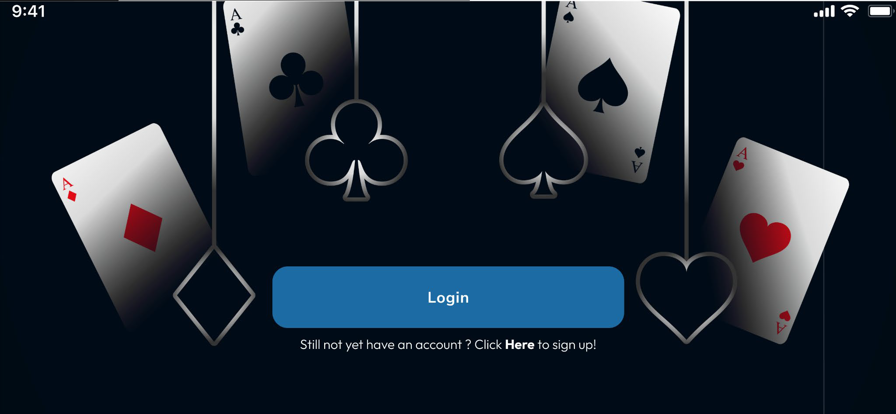
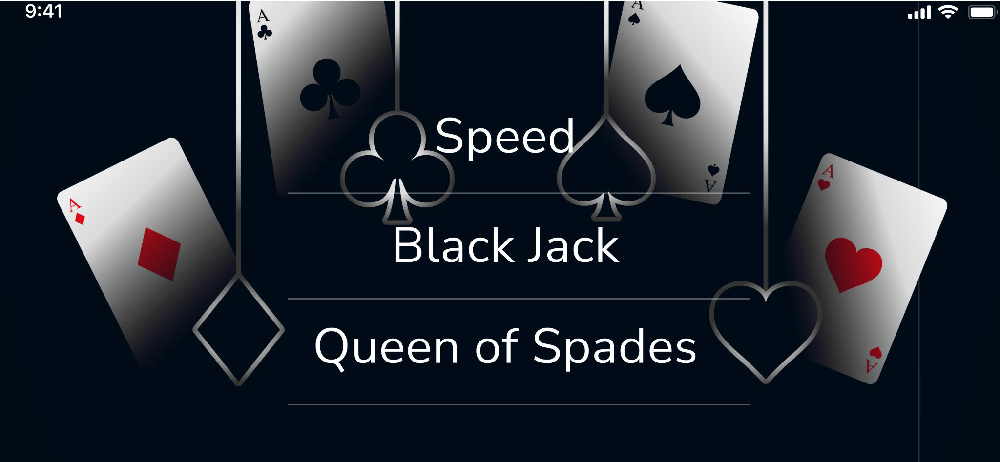
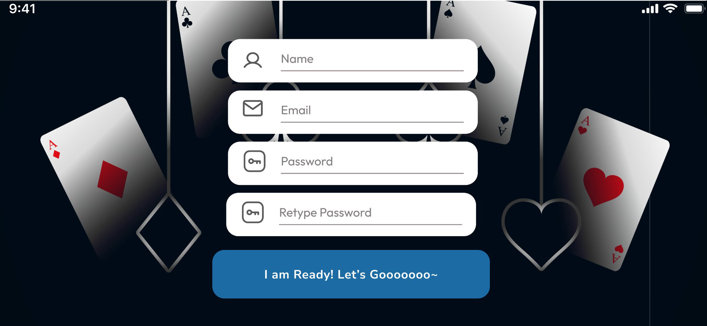
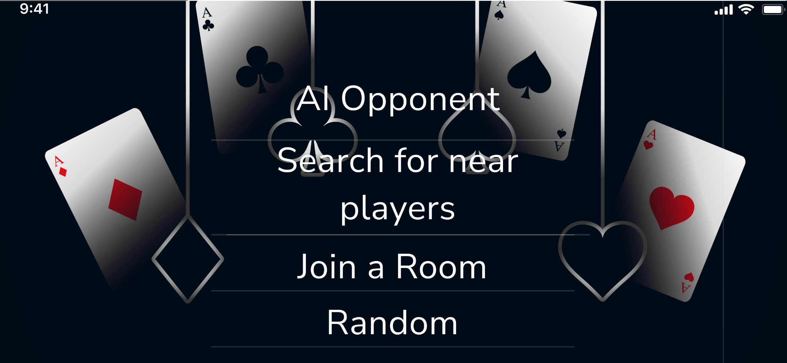
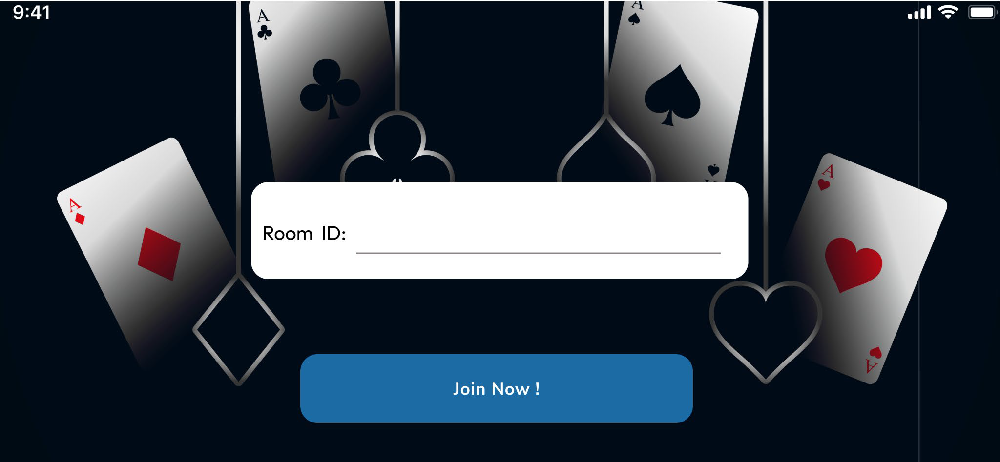

## Data Storage
For the secure and organized storage of user data, we have opted to use Firebase Firestore. Our data structure involves the creation of a "user" collection, which utilize the "document" data type to store personal information for each player. To facilitate efficient data management, we store the data in a map format. By using this approach, we can ensure that user data is stored, retrieved, and updated in a reliable and efficient manner.

<!-- 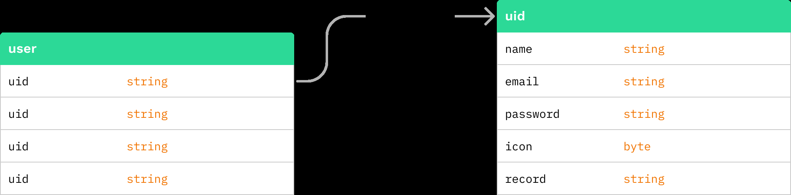 -->
<figure class="image">
  
  <figcaption>The data structure of user collection</figcaption>
</figure>

<!-- 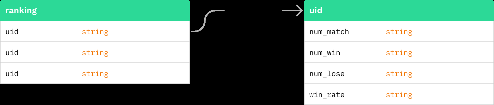 -->
<figure class="image">
  
  <figcaption>The data structure of ranking system</figcaption>
</figure>

Before accessing the Firebase, it is required to set up the environment and the dependency.
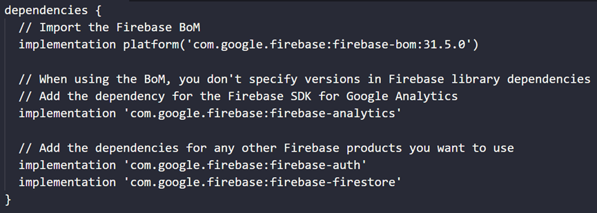

With the correct accessing path, the data can be retrieved as a map (eg. data) and accessed the specific data value by different keys (eg. username). The data can be stored, retrieved, or updated with the function template shown below:
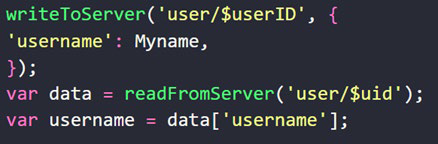

## Specific Android Features
### Firebase Authentication
We plan to integrate Firebase Authentication with Google Login into the game that can provide many benefits to both the developer and the players. By using this authentication method, players can easily sign in to the game using their existing Google account, which eliminates the need for them to create a new set of login credentials. This can increase the adoption rate of the game as users are more likely to sign up and start playing if they don't have to go through the hassle of creating a new account. Additionally, Firebase Authentication provides a secure and scalable solution for managing user authentication, which can help protect user data and prevent unauthorized access to the game. From a developer's perspective, Firebase Authentication with Google Login can provide a streamlined and efficient way to manage user authentication, allowing them to focus on other aspects of the game. Overall, integrating Firebase Authentication with Google Login can lead to a better user experience and increased user retention in Android card games.

### GPS Location
To enhance the user experience, the app has been designed to enable nearby players to match and play against each other. This is achieved by collecting GPS location data from the device through the GPS_PROVIDER provided by the Location Manager, and sending it to the Firebase Realtime Database. This location data is then used to compare the locations of other players within a 1km radius of the user's location, and display them in the app.
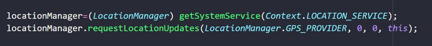

The aforementioned code initializes the Location Manager and requests location updates from the GPS_PROVIDER to keep track of the user's location in real-time. Once the user's location has been obtained, it is stored in the Firebase Realtime Database, allowing it to be accessed and compared with the locations of other players.
We have implemented a location listener and a thread to update the location of the players to a Realtime Database every five seconds, in order to keep track of their movements. Additionally, we have implemented a listener to detect any updates made to the Realtime Database, which triggers a scan through the map to determine if any players are in close proximity to each other. The distance between the players is calculated using the Haversine formula, which takes into account the curvature of the Earth's surface, resulting in more accurate distance calculations.
This approach not only provides an engaging and interactive experience for players but also leverages the power of Firebase Realtime Database to store and retrieve location data efficiently and in real-time, ensuring that the app remains responsive and up-to-date. By leveraging the latest technologies, the app offers a seamless and enjoyable experience for players seeking to match and play against nearby opponents.

### Animation
In our implementation we first create a Stage object, which serves as a container for the image actors. We then load the texture for the actors and create a list to hold them. We initialize all 54 image actors, setting their positions, adding them to the stage, and adding them to the list. This step lays the foundation for creating a visually appealing and interactive scene.
Next, we leverage the SequenceAction class to create a complex animation sequence. We use a series of MoveToAction objects to specify the final position of each image actor and the duration of the movement. We add each MoveToAction to the sequence using the addAction() method, creating a dynamic and visually stimulating movement pattern.
Finally, we apply the action sequence to each of the image actors by adding the sequence to each actor using the addAction() method. This step allows us to seamlessly integrate the animation sequence with the actors on the stage, creating a cohesive and engaging user experience.

## Expected results
With the goal of delivering a fluid and streamlined gaming experience, the Battle K'ard game app has been created with the end-user in mind. The functionality and features of the app can be roughly divided into three categories.
The first part of the app pertains to registration. To facilitate a hassle-free registration process, a login page has been incorporated, which allows users to either register a new account or login with their Gmail credentials. The login page prompts users to input their email, password, username, and select an icon of their choice. Upon successful registration, users can proceed to the game screen and commence playing.
The second part of the app is dedicated to entertainment. The selection screen provides users with the option to choose their preferred game, along with displaying their current ranking, number of games won, number of game losses, and win rate. Additionally, users can opt to play with friends, thereby enhancing the social aspect of the game. After all the setting players will be able to play the games.
The final part of the app is playing and sharing with friends. The player can press or drag the cards depending on the game type. We also expected to add some interaction buttons so the players will be able to do some interactions while they are playing the game.

## Gameplay results
<!-- 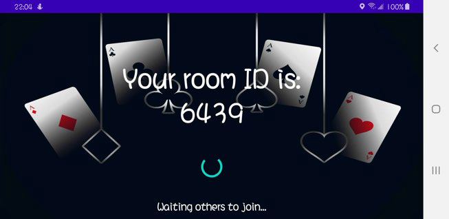 -->
<figure class="image">
  
  <figcaption>Figure 1a: Create Room</figcaption>
</figure>

<!-- 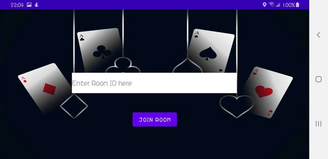 -->
<figure class="image">
  
  <figcaption>Figure 1b: Join Room</figcaption>
</figure>

<!-- 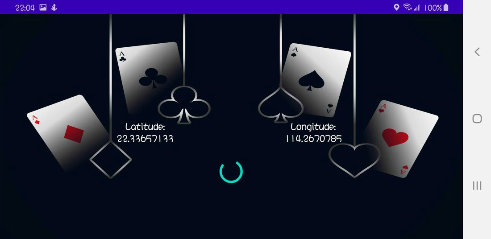 -->
<figure class="image">
  
  <figcaption>Figure 2: Create and join room by Nearby rooms
</figcaption>
</figure>

<!-- 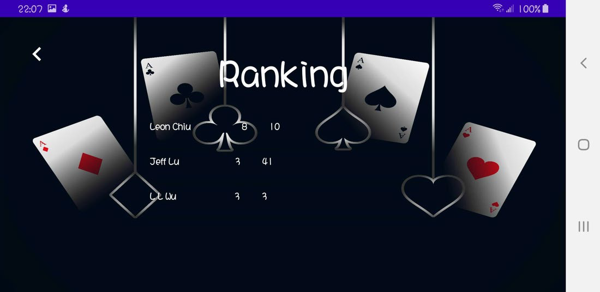 -->
<figure class="image">
  
  <figcaption>Figure 3: Ranking page
</figcaption>
</figure>

The above screenshots are the paring page and ranking page. In Figures 1a and 1b, players can create a room and join a room by inputting the room ID. Figure 2 shows that the player can play against random people by searching the nearby player. Figure 3 shows all player and their ranking, including number of wins and losses.

<!--  -->
<figure class="image">
  
  <figcaption>Figure 4: Instruction page of Black Jack
</figcaption>
</figure>

<!-- 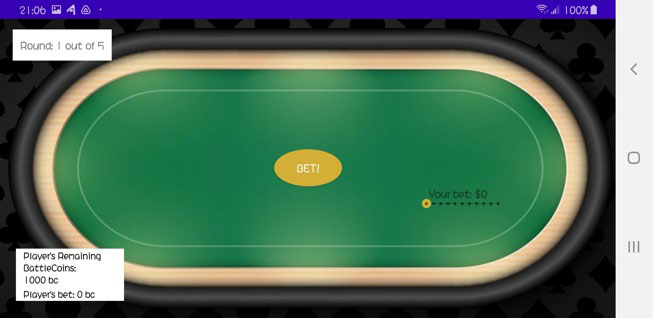 -->
<figure class="image">
  
  <figcaption>Figure 5a: Betting page
</figcaption>
</figure>

<!-- 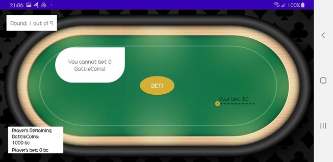 -->
<figure class="image">
  
  <figcaption>Figure 5b: 0 bet warning
</figcaption>
</figure>

<!-- 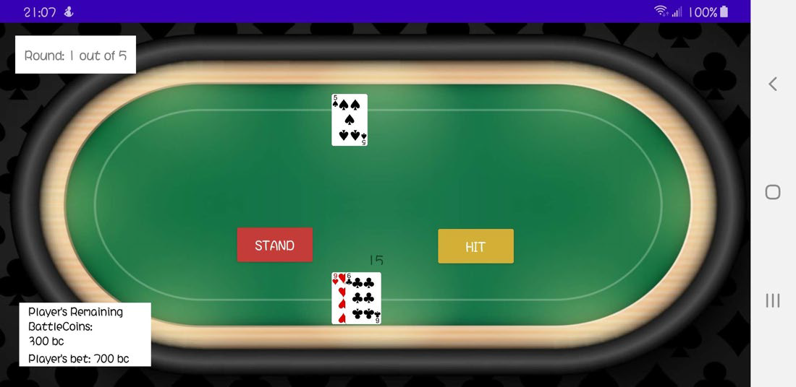 -->
<figure class="image">
  
  <figcaption>Figure 6: Game play page
</figcaption>
</figure>

<!-- 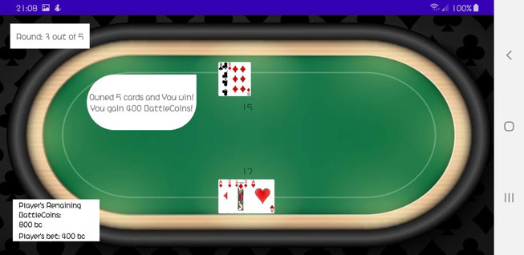 -->
<figure class="image">
  
  <figcaption>Figure 7a: Winning condition sample 1
</figcaption>
</figure>

<!-- 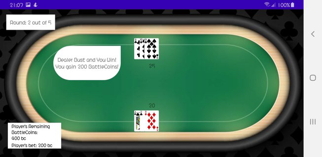 -->
<figure class="image">
  
  <figcaption>Figure 7b: Winning condition sample 2
</figcaption>
</figure>

<!-- 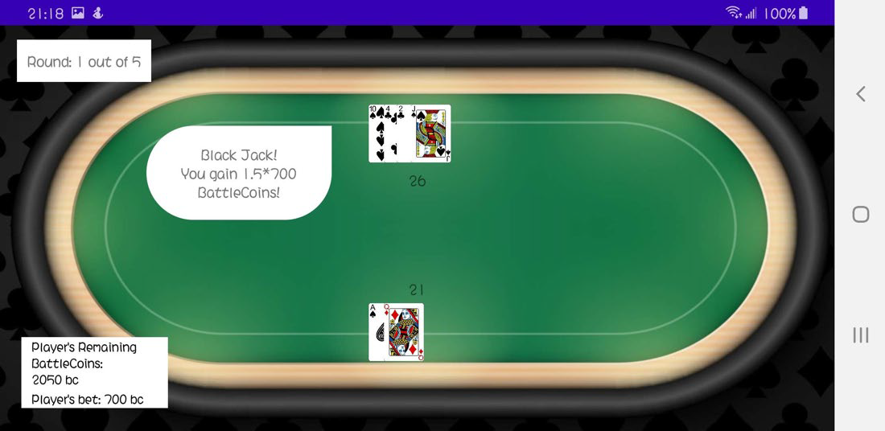 -->
<figure class="image">
  
  <figcaption>Figure 7c: Winning condition sample 3
</figcaption>
</figure>

<!--  -->
<figure class="image">
  
  <figcaption>Figure 8a: Losing condition sample 1
</figcaption>
</figure>

<!--  -->
<figure class="image">
  
  <figcaption>Figure 8b: Losing condition sample 1
</figcaption>
</figure>

<!--  -->
<figure class="image">
  
  <figcaption>Figure 9a: Ending condition sample 1
</figcaption>
</figure>

<!-- 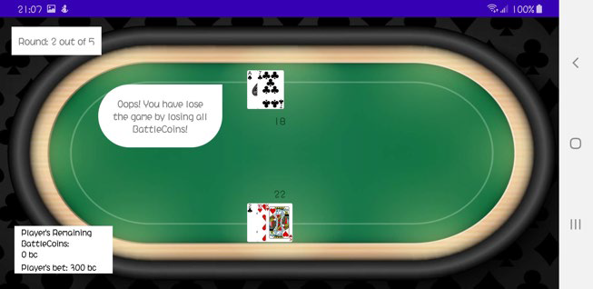 -->
<figure class="image">
  
  <figcaption>Figure 9b: Ending condition sample 2
</figcaption>
</figure>

The above screenshots are the gameplay of Black Jack. It contains multiple elements such as TextView, Button, and Soundpool as music effects, etc. Users can play the game easily by sliding or pressing buttons only. For new players, we included a simple instruction page for users to understand and know how to play our game. From Figures 7, 8 and 9, we added different text popouts in different situations to immerse users in the game and improve their gaming experience.

<!-- 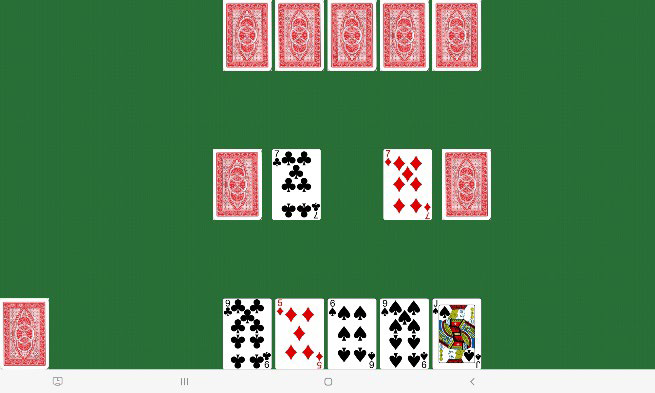 -->
<figure class="image">
  
  <figcaption>Figure 10a: Speed gameplay
</figcaption>
</figure>

<!-- 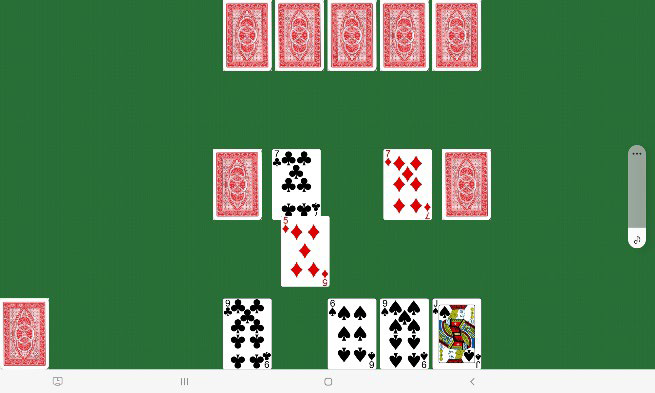 -->
<figure class="image">
  
  <figcaption>Figure 10b: Speed gameplay – moving card
</figcaption>
</figure>

<!-- 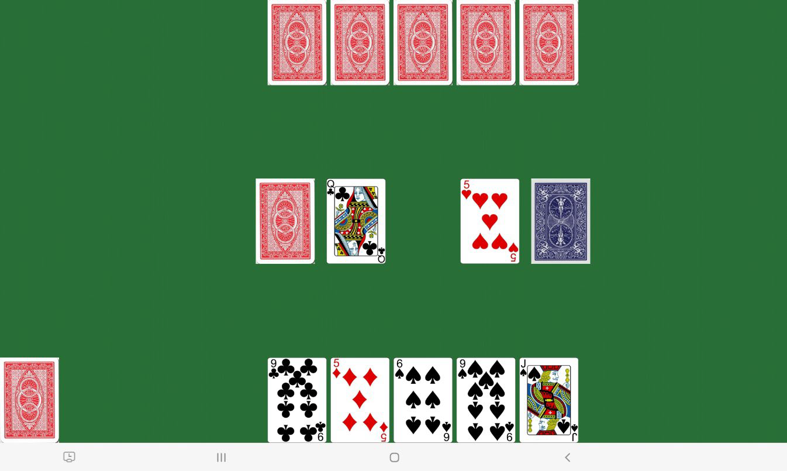 -->
<figure class="image">
  
  <figcaption>Figure 10c: Speed gameplay – Draw new card
</figcaption>
</figure>

The above screenshots are the gameplay of Speed. From Figures 10a and 10b, the player can place his Heart 10 into the left-hand side piles. The player can play the game by dragging

the card to it. From Figure 10c, since no more cards can place by either Ai or the player, the player can press the covered card to draw a new card from it and continue the game.

<!--  -->
<figure class="image">
  
  <figcaption>Figure 11a: Ending page – Win
</figcaption>
</figure>

<!-- 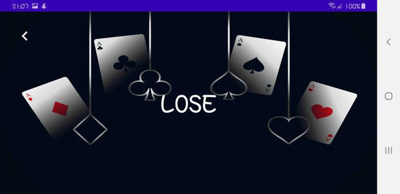 -->
<figure class="image">
  
  <figcaption>Figure 11b: Ending page – Lose
</figcaption>
</figure>

The above screenshots are the ending page. After playing Black Jack or Speed, the ending page will display "Win” or “Lose” according to player status that shown in Figures 11a and 11b. The number of wins and losses will also upload and stored on the server.